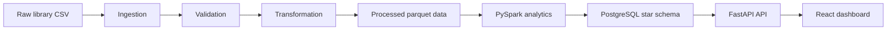

# LibraSight

LibraSight is a library analytics and data engineering project built to ingest raw circulation data, validate quality issues, clean and transform the records, generate analytical outputs, and expose business insights through a FastAPI backend and React dashboard.

## Project purpose

The platform is designed for library operations teams and analysts who need to understand:

- circulation trends
- reader behavior and library usage
- branch performance
- collection health and availability
- data-quality issues across source records

The solution combines ETL, warehouse loading, reporting, and visualization into a single end-to-end project for local analytics and demonstration workflows.

## Current project scope

This repository contains the following major components:

- `ingestion/` — raw data ingestion and schema/input handling
- `validation/` — rule-based validation, rejected-record handling, and data-quality reporting
- `transformation/` — cleaning, normalization, and parquet export logic
- `spark/` — PySpark aggregation jobs and generated analytical outputs
- `database/` — SQL schema and warehouse loading scripts
- `backend/` — FastAPI application and endpoint layer
- `frontend/` — Vite + React dashboard UI
- `airflow/` — orchestration DAG for ETL workflow execution
- `data/` — raw, processed, and quality output files
- `tests/` — automated validation for API, data extraction, transformation, Spark jobs, and reports

## Technology stack

- Python 3.11+
- Pandas, NumPy, PyArrow
- PySpark 4.2.0
- SQLAlchemy + PostgreSQL
- FastAPI + Uvicorn
- React 18 + Vite
- Apache Airflow 3.3.1
- Docker + Docker Compose
- ReportLab, PyPDF, Matplotlib

## Features

This section summarizes the main features and capabilities implemented in LibraSight. Each area lists concrete behaviors, outputs, and extension points so contributors and users can quickly understand what the system delivers.

- Ingestion
    - Flexible CSV/TSV readers with schema hints and header normalization.
    - Pluggable reader interfaces in `ingestion/readers.py` to support new sources (JSON, API, database exports).
    - Input validation hooks to reject or flag malformed rows during ingestion.
    - Batch and single-file ingestion modes with configurable chunk sizes to limit memory use.

- Validation & Data Quality
    - Rule-driven validation engine in `validation/validate.py` covering structural, type, logical, and domain-specific checks.
    - Detailed rejection records written to `data/quality/rejected_records.csv` with failure reasons and source pointers.
    - Aggregate data-quality reports (`data/quality/data_quality_report.csv`) summarizing counts by rule, severity, and source file.
    - Duplicate detection and canonicalization rules for borrower and item identifiers.

- Transformation & Enrichment
    - Cleaning and normalization implemented in `transformation/clean_transform.py` (dates, name normalization, code mapping).
    - Field-level enrichment (age calculation, derived loan durations, circulation flags) and canonical field mapping.
    - Parquet export of cleaned datasets for efficient downstream processing (`data/processed/`).

- PySpark Analytics
    - PySpark job collection under `spark/jobs/` that generates analytical aggregates (monthly trends, branch metrics, genre/collection analytics).
    - Multi-stage aggregation pipeline with partitioned outputs in `spark/output/` for efficient downstream querying.
    - Reusable metrics templates for new aggregation tasks (e.g., cohort analysis, retention curves).

- Warehouse & Loading
    - Star-schema loading scripts in `database/` with staging tables and idempotent loader logic.
    - SQL queries and schema definitions to support dimensional reporting and fast rollups (`database/schema.sql`, `database/queries.sql`).

- Backend API
    - FastAPI application with analytics endpoints in `backend/app/` exposing time-series aggregates, KPI endpoints, and data-quality summaries.
    - OpenAPI docs available at `/docs` and health / readiness endpoints for orchestration.
    - Pagination, filtering, and date-range query support for large result sets.

- Frontend Dashboard
    - React + Vite frontend providing interactive charts, filter panels, and drilldowns for branch, collection, and reader analytics.
    - Reusable chart components and services under `frontend/src/` for quick extension of new visualizations.

- Orchestration & Scheduling
    - Airflow DAG `airflow/dags/library_etl_dag.py` for end-to-end ETL orchestration with clear task boundaries: ingest → validate → transform → spark → load → report.
    - Local Docker Compose setup for reproducible Airflow deployment and easy testing.

- Reporting & Exports
    - PDF generation utilities and report templates for scheduled or ad-hoc reporting (ReportLab, PyPDF integration).
    - CSV and JSON export endpoints for downstream systems and BI tooling (e.g., Power BI templates under `powerbi/`).

- Observability & Testing
    - Pytest coverage for ingestion, validation, transformation, and Spark outputs (`tests/`).
    - Log collection under `airflow/logs/` and simple metrics endpoints to support monitoring.

- Security & Privacy
    - PII handling guidance: configurable removal or hashing of personally-identifiable fields during transformation.
    - Principle of least privilege recommended for database credentials and deployment secrets (use environment variables / secrets store).

- Extensibility & Configuration
    - Centralized configuration via environment variables and small config modules to enable different deployment profiles (dev, staging, prod).
    - Clear extension points: add new readers, validation rules, Spark metrics, or frontend widgets with well-documented module boundaries.

- Deployment & Scaling
    - Dockerized components and Compose scripts to run locally; the architecture supports containerized scaling for Spark and Postgres in cloud deployments.

- Example Use Cases
    - Monthly circulation trend reports, branch performance dashboards, collection turnover analysis, reader retention cohorts, and data-quality monitoring for source systems.

## High-level architecture



## Workflow summary

1. Raw library records are ingested from source files.
2. Validation checks identify structural, numeric, date, missing-value, range, and logical integrity issues.
3. Cleaned data is transformed and exported for downstream analysis.
4. PySpark jobs aggregate the processed data into analytical outputs.
5. Results are loaded into a PostgreSQL warehouse structure.
6. The backend exposes analytics endpoints for dashboard and report use.
7. The frontend visualizes trends and operational metrics.

## Data-quality model

The project includes automated validation coverage for:

- structural checks
- duplicate detection
- missing values
- data type integrity
- date validation
- range constraints
- logical consistency checks

Examples from the current validation rules include:

- duplicate records
- age outside 0–120
- invalid publication year
- negative fine amount
- negative available copies
- available copies exceeding total copies
- due or return dates earlier than checkout date

These validation results are written to the data-quality outputs under `data/quality/` and surfaced by the API summary endpoints.

## Operating environment

### Prerequisites

- Python 3.11 or newer
- Node.js 18+
- pip
- Docker + Docker Compose for the Airflow workflow

### Backend setup

From the project root:

```bash
python -m venv .venv

# Windows PowerShell
.venv\Scripts\Activate.ps1
```

Then install the backend dependencies:

```bash
pip install -r requirements.txt
```

To start the API from the backend folder:

```bash
cd backend
python -m uvicorn app.main:app --host 0.0.0.0 --port 8000 --reload
```

Endpoints available include:

- http://localhost:8000
- http://localhost:8000/docs

### Frontend setup

```bash
cd frontend
npm install
npm run dev -- --host 0.0.0.0 --port 4173
```

Frontend UI:

- http://localhost:4173

### Airflow orchestration

The project includes a containerized Airflow DAG for the ETL pipeline:

```bash
docker-compose up --build
```

Airflow UI:

- http://localhost:8080

## Manual ETL execution

The pipeline components can also be run directly from the project root:

```bash
python ingestion/ingest.py
python validation/validate.py
python transformation/clean_transform.py
python spark/jobs/library_spark_job.py
python database/load_data.py
```

Generated outputs are stored in:

- `data/raw/`
- `data/processed/`
- `data/quality/`
- `spark/output/`

## Testing and verification

The project includes pytest-based verification for:

- ETL ingestion and readers
- validation logic
- transformation behavior
- Spark output generation
- PDF and report generation
- API endpoints

Run tests with:

```bash
pytest
```

## Current status

The repository is a working local analytics prototype with a complete data pipeline, validation framework, API layer, and dashboard frontend. It is suitable for local demonstration, project reporting, and further enhancement.

## Notes for reporting and future documentation

This repository is well suited for use as a reference project in technical documentation, business reporting, and project summary materials. The primary technical themes are:

- library data engineering
- dataset quality governance
- analytical warehouse modeling
- operational reporting
- dashboard-based insight delivery

## Contributing

Contributions are welcome. Changes to the pipeline, validation rules, API behavior, or UI should be reflected in tests and relevant documentation.

## License

No root license file is currently present in the repository. This section should be updated when a formal project license is added.
