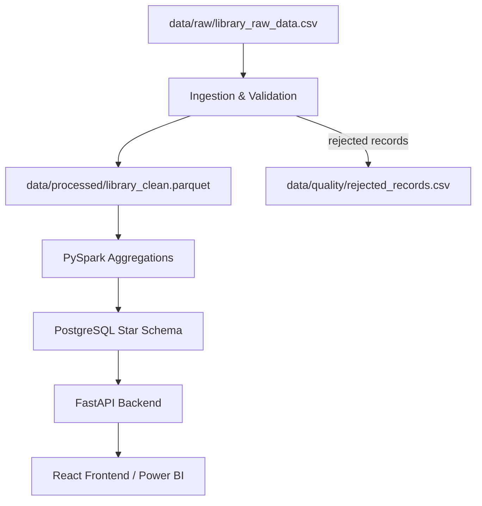

## LibraSight

LibraSight is an end-to-end Library Analytics and Data Engineering platform that ingests, validates, transforms, aggregates, and exposes library circulation and catalog data for analytics, reporting, and BI.

## Table of Contents
- Problem Statement (PS)
- Proposed Solution
- The Project
- Features
- Tech Stack
- Architecture
- Installation & Setup
- Usage
- Development
- Contributing
- License

## Problem Statement (PS)

Large library networks collect transactions from multiple sources (legacy terminals, kiosks, web portals, manual entry). Data arrives with inconsistent schemas, missing or invalid values, and logical errors (dates out of order, negative fines, inventory mismatches). This causes inaccurate KPIs, slow analytical queries, and manual reporting overhead.

## Proposed Solution

LibraSight provides a reproducible, containerized pipeline that:
- Enforces ingestion contracts and schema validation.
- Runs multi-stage data quality checks and quarantines invalid records.
- Converts cleaned data to columnar Parquet for fast analytics.
- Runs distributed aggregations with PySpark and loads results into a star-schema PostgreSQL warehouse.
- Exposes analytics via a FastAPI backend and a React dashboard; generates PDF reports and Power BI-ready artifacts.

## The Project

This repository contains the full pipeline and application components:
- `ingestion/` — ingestion scripts and schema checks.
- `validation/` — data quality checks and quarantine logic.
- `transformation/` — cleaning, deduplication, and Parquet export.
- `spark/` — PySpark jobs and aggregation logic.
- `database/` — DDL, loader scripts, and analytical SQL.
- `backend/` — FastAPI application and routers.
- `frontend/` — React SPA (Vite) for dashboards and reports.
- `airflow/` — DAGs and container orchestration for scheduled runs.

## Features

- Ingestion contract enforcement and header validation.
- 60+ data quality checks (structural, type, missing, range, logical).
- Quarantine of rejected records and audit report generation.
- Parquet export for columnar storage and efficient reads.
- PySpark distributed analytics producing multiple aggregated outputs.
- Star-schema PostgreSQL data warehouse optimized for analytical queries.
- FastAPI asynchronous REST endpoints for KPIs and reporting.
- Dynamic PDF report generation.
- React dashboard with charts and tables; Power BI model artifacts.

## Tech Stack

- Python 3.11+ (Pandas, PySpark, PyArrow)
- Apache Spark (PySpark)
- Apache Airflow (DAG orchestration)
- PostgreSQL 16 (data warehouse)
- FastAPI + Uvicorn (backend)
- React 18 + Vite (frontend)
- Docker & docker-compose (containerization): used to run the full stack consistently across local development and deployment environments, including PostgreSQL, Airflow, the API, and the frontend. It helps avoid "works on my machine" issues by standardizing versions, networking, and startup order.
- ReportLab (PDF generation)
- Power BI (business reporting)

Note: Docker is recommended for the full project setup, but it can be skipped if you are only running a subset of services manually in a local Python environment. For example, you can run the ingestion, transformation, and Spark jobs directly with Python and start the FastAPI app separately, but you lose the convenience and consistency of the containerized environment.

## Architecture (high-level)

1. Raw CSV ingestion -> schema verification -> validation/quarantine
2. Cleaned records -> Parquet (data/processed)
3. PySpark aggregations -> `spark/output/*`
4. Loader -> PostgreSQL star schema
5. FastAPI serves analytics to React frontend and report generator

Mermaid diagram (viewers that support Mermaid will render this):



## Installation & Setup

Prerequisites: `python 3.11+`, `docker`, `docker-compose` (recommended for the full containerized stack)

Quick start (local, development):

> Docker is not strictly required for every workflow. If you prefer not to use it, you can run each component manually in a Python environment as long as the required dependencies and service endpoints are configured. Docker simply makes the setup easier and more reproducible.

1. Create and activate a virtual environment:

```bash
python -m venv .venv
source .venv/Scripts/activate  # Windows: .venv\Scripts\activate
pip install -r requirements.txt
```

2. Run services with Docker Compose (recommended for full stack):

```bash
docker-compose up --build
```

3. Run specific components locally:

```bash
# Ingest and validate raw data
python ingestion/ingest.py

# Run transformation
python transformation/clean_transform.py

# Run PySpark job (local)
python spark/jobs/library_spark_job.py

# Start API server
uvicorn backend.main:app --reload
```

## Usage

- Access the UI at `http://localhost:3000` (Vite dev server) or the served frontend port configured in `docker-compose.yml`.
- API endpoints are documented in the FastAPI interactive docs (e.g., `http://localhost:8000/docs`).
- Generated Parquet and Spark outputs are stored under `data/processed/` and `spark/output/` respectively.

## Development

- Run unit tests with `pytest`.
- Linting and formatting: `black .` and `ruff .` (if configured).
- To iterate on the frontend: `cd frontend && npm install && npm run dev`.

## Contributing

Contributions are welcome. Please open issues for bugs or feature requests and submit PRs for proposed changes. Follow repository coding standards and include tests for new functionality.

## License

This project is provided under the MIT License. See `LICENSE` for details.

## Contact

For questions or support, open an issue or contact the maintainers.
