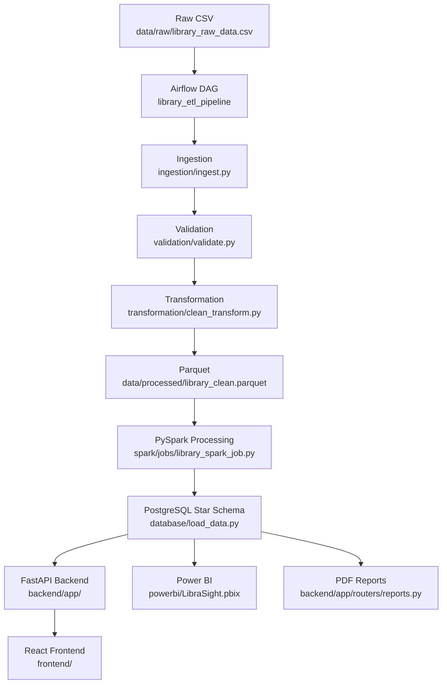

LibraSight — System Architecture

Overview

LibraSight is a small end-to-end library analytics pipeline that ingests a raw CSV of library transactions, validates and cleans the data, performs analytic aggregation using PySpark, and loads a PostgreSQL star-schema warehouse. The warehouse powers a FastAPI backend and a React frontend; Power BI and PDF reports consume the final star schema for additional analytics and exports.

Major components

- Ingestion: `ingestion/ingest.py` (reads `data/raw/library_raw_data.csv`)
- Validation: `validation/validate.py` (data quality checks, writes `data/quality` reports)
- Transformation: `transformation/clean_transform.py` (cleans, standardizes, writes `data/processed/library_clean.parquet`)
- Spark analytics: `spark/jobs/library_spark_job.py` (reads Parquet, creates analytic Parquet outputs under `spark/output/`)
- Data warehouse loader: `database/load_data.py` (loads dimensions and fact into PostgreSQL star schema)
- Orchestration: Airflow DAG `airflow/dags/library_etl_dag.py` (runs the full pipeline in sequence)
- Backend/API: FastAPI application at `backend/app/` (routers under `backend/app/routers/`)
- Frontend: React app under `frontend/` (communicates with FastAPI)
- BI & Reporting: `powerbi/LibraSight.pbix` (Power BI file) and PDF report generation under `backend/app/routers/reports.py` and `reports/` output.

Technologies used

- Python 3.x, pandas, PySpark
- Airflow (DAG orchestration)
- PostgreSQL (star-schema data warehouse)
- FastAPI (REST API)
- React + Vite (frontend)
- Power BI (desktop PBIX file)
- PyArrow Parquet for columnar storage

End-to-end data pipeline (summary)

Notes

- The repository is intentionally organized around a single clear ETL flow. All code referenced above is present in the repository; documentation in this folder points to the actual files used by the pipeline.
