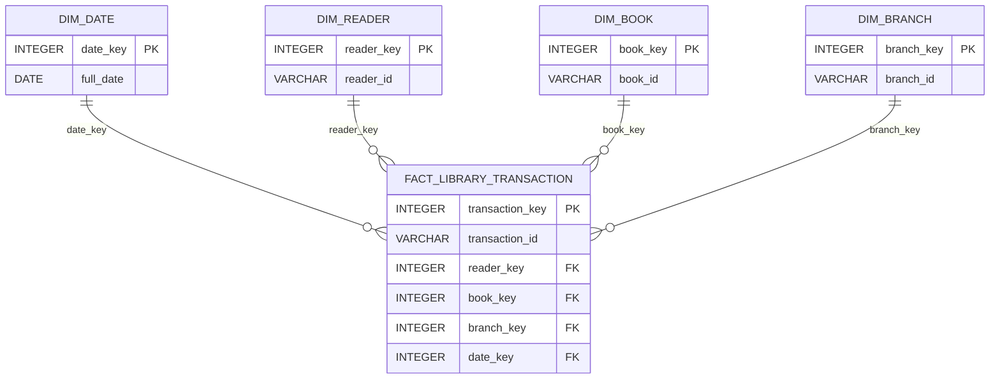

# ER Diagram — LibraSight Star Schema

The warehouse implements a star schema with one central fact table and four dimension tables.

Entities (tables):

- `dim_date`
- `dim_reader`
- `dim_book`
- `dim_branch`
- `fact_library_transaction`

Mermaid ER diagram (simplified):

Primary keys, foreign keys and cardinality are described in the `relationships.md` and `table_descriptions.md` documents.
